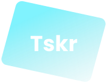
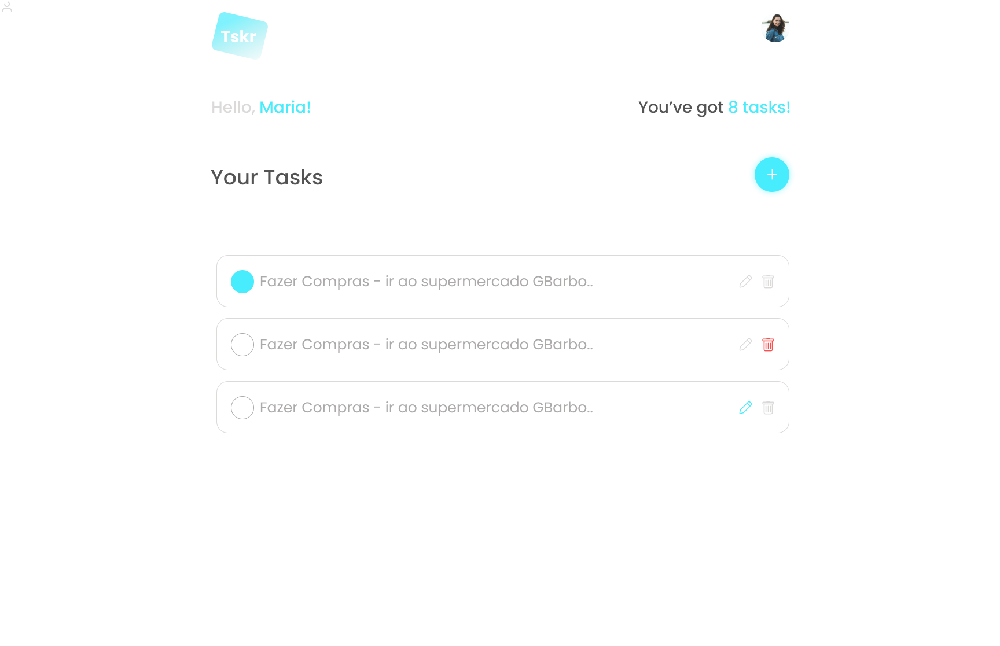

<p align="center">
  
</p>

<h1 align="center" style="margin: 16px 0;">Tskr</h1>

<p align="center" style="margin-top: 16px;">
Web application developed in React.js and Next.js in order to demonstrate client-server communication.
</p>

<p align="center" style="margin-top: 2.5rem;">
  
</p>

<br />

<h3 style="font-size: 2rem">About the project ⚡</h3>

<p style="margin-bottom: 2.5rem;">This project aims to demonstrate the basic operations in a postgreSQL database by communicating with a rest node.js api. I used some of the best technologies to develop this project. see what these technologies are below.</p>

<h3 style="font-size: 2rem;">Application Features ✨</h3>

<h3 style="font-size: 1.5rem; margin-bottom: 1rem;">🤗 User</h3>

<ul style="margin-bottom: 1rem;">
  <li>Create user</li>
  <li>Find user's data</li>
  <li>Update user</li>
  <li>Authenticate user</li>
</ul>

<h3 style="font-size: 1.5rem;">📃 Task</h3>

<ul>
  <li>Create task</li>
  <li>Find user's tasks</li>
  <li>Update task</li>
  <li>Delete task</li>
</ul>

<h3 style="font-size: 2rem;">Aplication Techs 💻</h3>

<ul style="margin-bottom: 2.5rem;">
  <li>
    <a href="https://reactjs.org/docs/getting-started.html" target="_blank">
      React.js
    </a>
  </li>
  <li>
    <a href="https://nextjs.org" target="_blank">
      Next.js
    </a>
  </li>
  <li>
    <a href="https://axios-http.com/docs/intro" target="_blank">
      Axios
    </a>
  </li>
  <li>
    <a href="https://github.com/maticzav/nookies" target="_blank">
      Nookies
    </a>
  </li>
  <li>
    <a href="https://phosphoricons.com" target="_blank">
      Phosphor-react
    </a>
  </li>
  <li>
    <a href="https://reactcommunity.org/react-modal" target="_blank">
      React-modal
    </a>
  </li>
  <li>
    <a href="https://styled-components.com" target="_blank">
      Styled-Components
    </a>
  </li>
</ul>

# How to start the project?

<p>Clone the repository with: git clone git@github.com:henrique1758/tasker-web</p>

<p>Install the dependencies with the command:</p>

```sh
yarn
```
<p>To execute the server run the command:</p>

```sh
yarn dev
```

# Api Project

<p style="margin-bottom: 1rem;">
  See the api project at:
  <a href="https://github.com/henrique1758/tasker-server" target="_blank">Api project</a>
</p>

# Author 

<h3>Henrique Monteiro</h3>

<ul style="margin-bottom: 1rem;">
  <li>
    Linkedin: <a href="https://www.linkedin.com/in/henrique-monteiro-3a936a223/" target="_blank">@henriquemonteiro3a936a223</a>
  </li>
  <li>
    Github: <a href="https://github.com/henrique1758/" target="_blank">@henrique1758</a>
  </li>
</ul>

Give a ⭐️ if this project helped you!